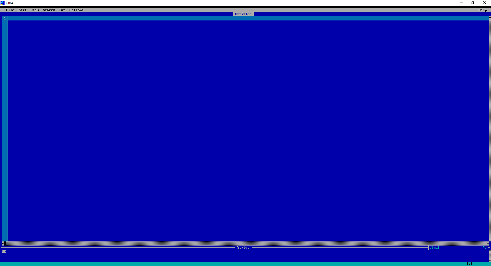

# Linux and macOS

If you are a Linux or macOS user, you can run the program using the coding language TAC was made in. TAC is coded in QB64. You can download QB64 at [https://github.com/Galleondragon/qb64/releases/](https://github.com/Galleondragon/qb64/releases/).

Download the file. A tutorial video you can find online is: [https://www.youtube.com/watch?v=PcwDD06VK\_0](https://www.youtube.com/watch?v=PcwDD06VK_0) \(in the video, it tells you how to also download QBasic 1.1. do not download QBasic 1.1, unless you are using it something other than TAC\)

After you finish downloading and doing all the extracting stuff, run QB64.

You should see a IDE module like this:

If you haven't downloaded TAC already, do it. You should see a file called "[game.bas](https://github.com/text-adventure-creator/stable/blob/master/TAC%20Project/game.bas)". That is the source code. Open the file "[game.bas](https://github.com/text-adventure-creator/stable/blob/master/TAC%20Project/game.bas)" using QB64. You can open a file using Ctrl-O. After finding your file, open it.   
It should look like this.

