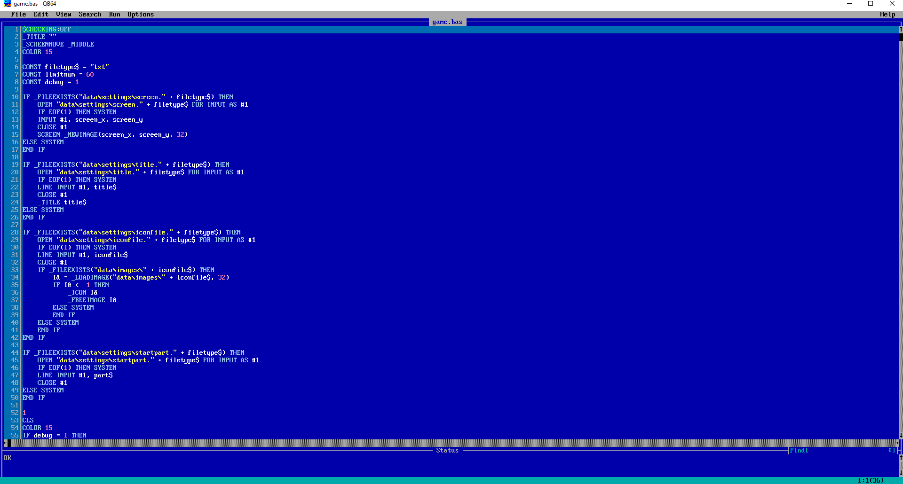

# Linux and macOS

If you are a Linux or macOS user, you can run the program using the coding language TAC was made in. TAC is coded in QB64. You can download QB64 at [https://github.com/Galleondragon/qb64/releases/](https://github.com/Galleondragon/qb64/releases/).

Download the file.


Windows: [Click Here!](https://www.schoolfreeware.com/Install_QB64_QBasic_On_Windows_10.html)  
Linux: [Click Here!](https://www.google.com/search?q=qb64+on+linux&rlz=1C1CHBF_enUS850US850&oq=qb64+on+linux&aqs=chrome..69i57j0l4.2839j0j7&sourceid=chrome&ie=UTF-8)  
macOS: [Click Here!](https://www.google.com/search?q=qb64+on+macOS&rlz=1C1CHBF_enUS850US850&oq=qb64+on+macOS&aqs=chrome..69i57j33.2204j0j7&sourceid=chrome&ie=UTF-8)


After you finish downloading and doing all the extracting stuff, run QB64.

You should see a IDE module like this:

If you haven't downloaded TAC already, do it. You should see a file called "[game.bas](https://github.com/text-adventure-creator/stable/blob/master/TAC%20Project/game.bas)". That is the source code. Open the file "[game.bas](https://github.com/text-adventure-creator/stable/blob/master/TAC%20Project/game.bas)" using QB64. You can open a file using Ctrl-O. After finding your file, open it.   
It should look like this.

Now, click the "Run" button in the menu and then click "Start".

Just wait a bit... soon, a program should open. If it doesn't or just instantly closes, that just means there is a error on the TAC project. The program file should've been made somewhere.

**It is recommended to "Source EXE to source folder", which is in the "Run" menu.**

