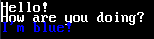

# Text, Images and Sound

Text and images are important to the game. They are the visuals and what the player sees in the game.

## text.\(filetype\)

You can put "text.\(filetype\)" in your part folder. This is used to make text in the program. Text overlap images in TAC.

Here is how the setup of the file works.

```text
Whatever text here. # extremely long text might go out of the screen, making it invisible
x of the text # must be a number (less than the size of the x of the screen but more than or equal to 0)
y of the text # must be a number (less than the size of the x of the screen but more than or equal to 0)
foreground color of the text
background color of the text # leave this as "?" to not set the background color.
font file (fonts must in the folder "data\fonts\") # leave this as "?" to set it as the default font.
font size # leave this as "?" if you set the font file as "?". you can not control the default font's size.
```

This can be looped over and over again.  
Example:

```text
Hello!
0
0
ffffff
?
?
?
How are you doing?
0
10
ffffff
?
?
?
I'm blue!
0
20
0000FF
?
?
?
```

This should look like:



## images.\(filetype\)

You can put "images.\(filetype\)" in your part folder. This is used to make images in the program. Images are under text in TAC.

Here is how the setup of the file works.

```text
imagefile.png (images must in the folder "data\images\") # all file types aren't support.
x of the image # must be a number
y of the image # must be a number
```

Just like text, this can be looped over and over again.

Here's a example image in the program:


## sound.\(filetype\)

You can put "sound.\(filetype\)" in your part folder. This is used to play sound in the program. Sounds only stop when the program closes or the sound ends. The sound cannot be looped and will continue while going to a new part. All sound files must be in the folder "data\sound\". 

